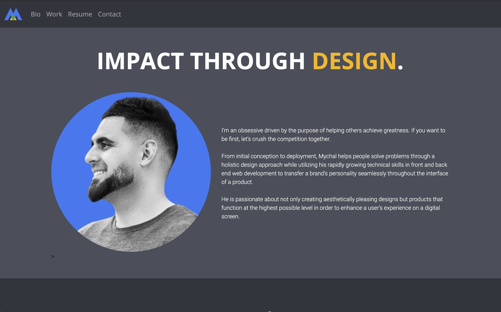

# Portfolio

## Summary

The goal of this project was to create an aesthetically pleasing portfolio website that demonstrates my skills as a growing web developer and designer. This application showcases three projects that I have completed in Denver University's Coding Boot Camp.

This was an extremely enjoyable project as UX/UI design is my favorite aspect of creating websites. Since I'm at an intermediate level and in the process of mastering other components of development, it will take some time before I can enable my contact form to store user entries. I can't wait to make this update in the future!

## Technologies Used

HTML 5 
CSS 3 
Bootstrap 4

## Deployed Links

[Portfolio](https://milehighcoder.github.io/portfolio) 
[Repository](https://github.com/milehighcoder/responsive-portfolio)

## Screenshots

